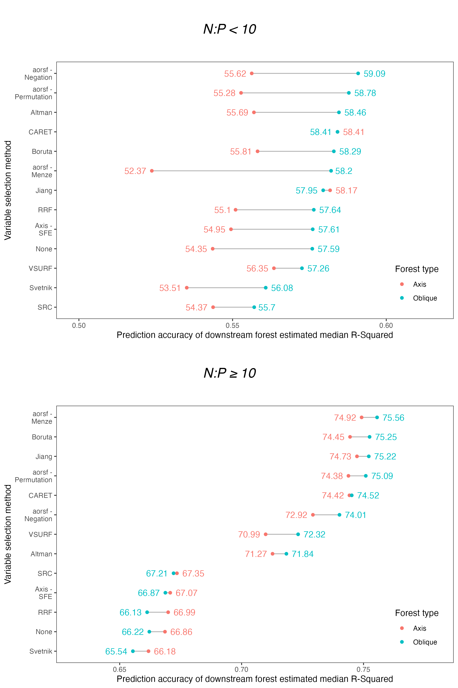

<!-- README.md is generated from README.Rmd. Please edit that file -->

# rfvs-regression

**Note**: The following work titled *A Comparison of Random Forest
Variable Selection Methods for Regression Modeling of Continuous
Outcomes* by O’Connell, N.S., Jaeger, B.C., Bullock, G.S., and Speiser,
J.L. is currently submitted for peer review publication.

<!-- badges: start -->
<!-- badges: end -->

The goal of rfvs-regression is to compare random forest variable
selection techniques for continuous outcomes. We compare several methods
available through various R packages and user defined functions from
published paper appendices. The code for implementing each RF variable
selection approach tested can be found in the function “rfvs()” and each
of the methods assessed and compared are given in the following table:

 

<table class="table" style="color: black; margin-left: auto; margin-right: auto;">
<thead>
<tr>
<th style="text-align:left;">
Abbreviation in Paper
</th>
<th style="text-align:left;">
Publication
</th>
<th style="text-align:left;">
R package
</th>
<th style="text-align:left;">
Approach
</th>
<th style="text-align:left;">
Type of forest method
</th>
</tr>
</thead>
<tbody>
<tr>
<td style="text-align:left;">
None
</td>
<td style="text-align:left;">
Breiman 2001
</td>
<td style="text-align:left;">
ranger
</td>
<td style="text-align:left;">
N/A
</td>
<td style="text-align:left;">
Axis
</td>
</tr>
<tr>
<td style="text-align:left;">
Svetnik
</td>
<td style="text-align:left;">
Svetnik 2004
</td>
<td style="text-align:left;">
Uses party, code from Hapfelmeier
</td>
<td style="text-align:left;">
Performance Based
</td>
<td style="text-align:left;">
Conditional Inference
</td>
</tr>
<tr>
<td style="text-align:left;">
Jiang
</td>
<td style="text-align:left;">
Jiang 2004
</td>
<td style="text-align:left;">
Uses party, code from Hapfelmeier
</td>
<td style="text-align:left;">
Performance Based
</td>
<td style="text-align:left;">
Conditional Inference
</td>
</tr>
<tr>
<td style="text-align:left;">
Caret
</td>
<td style="text-align:left;">
Kuhn 2008
</td>
<td style="text-align:left;">
caret
</td>
<td style="text-align:left;">
Performance Based
</td>
<td style="text-align:left;">
Axis
</td>
</tr>
<tr>
<td style="text-align:left;">
Altmann
</td>
<td style="text-align:left;">
Altmann 2010
</td>
<td style="text-align:left;">
vita
</td>
<td style="text-align:left;">
Test Based
</td>
<td style="text-align:left;">
Axis
</td>
</tr>
<tr>
<td style="text-align:left;">
Boruta
</td>
<td style="text-align:left;">
Kursa 2010
</td>
<td style="text-align:left;">
Boruta
</td>
<td style="text-align:left;">
Test Based
</td>
<td style="text-align:left;">
Axis
</td>
</tr>
<tr>
<td style="text-align:left;">
aorsf - Menze
</td>
<td style="text-align:left;">
Menze 2011
</td>
<td style="text-align:left;">
aorsf
</td>
<td style="text-align:left;">
Performance Based
</td>
<td style="text-align:left;">
Oblique
</td>
</tr>
<tr>
<td style="text-align:left;">
RRF
</td>
<td style="text-align:left;">
Deng 2013
</td>
<td style="text-align:left;">
RRF
</td>
<td style="text-align:left;">
Performance Based
</td>
<td style="text-align:left;">
Axis
</td>
</tr>
<tr>
<td style="text-align:left;">
SRC
</td>
<td style="text-align:left;">
Ishwaran 2014
</td>
<td style="text-align:left;">
randomForestSRC
</td>
<td style="text-align:left;">
Performance Based
</td>
<td style="text-align:left;">
Axis
</td>
</tr>
<tr>
<td style="text-align:left;">
VSURF
</td>
<td style="text-align:left;">
Genuer 2015
</td>
<td style="text-align:left;">
VSURF
</td>
<td style="text-align:left;">
Performance Based
</td>
<td style="text-align:left;">
Axis
</td>
</tr>
<tr>
<td style="text-align:left;">
aorsf-Negation
</td>
<td style="text-align:left;">
Jaeger 2023
</td>
<td style="text-align:left;">
aorsf
</td>
<td style="text-align:left;">
Performance Based
</td>
<td style="text-align:left;">
Oblique
</td>
</tr>
<tr>
<td style="text-align:left;">
aorsf- Permutation
</td>
<td style="text-align:left;">
Jaeger 2023
</td>
<td style="text-align:left;">
aorsf
</td>
<td style="text-align:left;">
Performance Based
</td>
<td style="text-align:left;">
Oblique
</td>
</tr>
<tr>
<td style="text-align:left;">
Axis - SFE
</td>
<td style="text-align:left;">
NA
</td>
<td style="text-align:left;">
ranger
</td>
<td style="text-align:left;">
Test Based
</td>
<td style="text-align:left;">
Axis
</td>
</tr>
<tr>
<td style="text-align:left;">
rfvimptest
</td>
<td style="text-align:left;">
Hapfelmeier 2023
</td>
<td style="text-align:left;">
rfvimptest
</td>
<td style="text-align:left;">
Test Based
</td>
<td style="text-align:left;">
Conditional Inference
</td>
</tr>
</tbody>
</table>

 

In this benchmarking study, we pulled datasets from *OpenML* and
*modeldata* following the criteria and steps outlined below:

# Datasets included

<table class="gt_table" data-quarto-disable-processing="false" data-quarto-bootstrap="false">
  <thead>
    <tr class="gt_col_headings">
      <th class="gt_col_heading gt_columns_bottom_border gt_left" rowspan="1" colspan="1" scope="col" id=""></th>
      <th class="gt_col_heading gt_columns_bottom_border gt_right" rowspan="1" colspan="1" scope="col" id="n">n</th>
    </tr>
  </thead>
  <tbody class="gt_table_body">
    <tr><th id="stub_1_1" scope="row" class="gt_row gt_left gt_stub">Datasets available</th>
<td headers="stub_1_1 n" class="gt_row gt_right">5012</td></tr>
    <tr><th id="stub_1_2" scope="row" class="gt_row gt_left gt_stub">With 'Supervised Regression' task</th>
<td headers="stub_1_2 n" class="gt_row gt_right">1635</td></tr>
    <tr><th id="stub_1_3" scope="row" class="gt_row gt_left gt_stub">With &lt;=50% missing observations</th>
<td headers="stub_1_3 n" class="gt_row gt_right">1620</td></tr>
    <tr><th id="stub_1_4" scope="row" class="gt_row gt_left gt_stub">With number of features &gt;= 10</th>
<td headers="stub_1_4 n" class="gt_row gt_right">1440</td></tr>
    <tr><th id="stub_1_5" scope="row" class="gt_row gt_left gt_stub">With number of features &lt;= 1000</th>
<td headers="stub_1_5 n" class="gt_row gt_right">325</td></tr>
    <tr><th id="stub_1_6" scope="row" class="gt_row gt_left gt_stub">With number of observations &gt;= 100</th>
<td headers="stub_1_6 n" class="gt_row gt_right">289</td></tr>
    <tr><th id="stub_1_7" scope="row" class="gt_row gt_left gt_stub">With number of observations &lt;= 10000</th>
<td headers="stub_1_7 n" class="gt_row gt_right">174</td></tr>
    <tr><th id="stub_1_8" scope="row" class="gt_row gt_left gt_stub">Remove simulated data1</th>
<td headers="stub_1_8 n" class="gt_row gt_right">110</td></tr>
    <tr><th id="stub_1_9" scope="row" class="gt_row gt_left gt_stub">Remove redundant data versions (use most recent)</th>
<td headers="stub_1_9 n" class="gt_row gt_right">90</td></tr>
    <tr><th id="stub_1_10" scope="row" class="gt_row gt_left gt_stub">Remove sparse ARFF data</th>
<td headers="stub_1_10 n" class="gt_row gt_right">86</td></tr>
    <tr><th id="stub_1_11" scope="row" class="gt_row gt_left gt_stub">Remove overly similar datasets</th>
<td headers="stub_1_11 n" class="gt_row gt_right">74</td></tr>
    <tr><th id="stub_1_12" scope="row" class="gt_row gt_left gt_stub">Remove data where outcome has &lt; 10 unique values</th>
<td headers="stub_1_12 n" class="gt_row gt_right">59</td></tr>
  </tbody>
  &#10;  <tfoot class="gt_footnotes">
    <tr>
      <td class="gt_footnote" colspan="2">1 Many datasets are different versions of the same data</td>
    </tr>
  </tfoot>
</table>

A total of 59 datasets met criteria and were used in this benchmarking
study. Summary characteristics of these datasets are given in the figure
below

# Benchmarking Study

We used five replications of split sample validation (i.e., Monte-Carlo
cross validation) for each dataset to evaluate RF variable selection
methods.

1.  First, a dataset was split into training (75%) and testing (25%)
    sets.

2.  Second, each variable selection method was applied to the training
    data, and the variables selected by each method were saved.

3.  Third, a standard axis-based RF model using the R package *ranger*
    and an oblique RF using the package *aorsf* were fit on the training
    data set using variables selected from each method, and R^2 was
    recorded based on the test data for each replication, method, and
    dataset.

4.  Fourth, methods of variable selection were compared based on
    computation time, accuracy measured by R^2, and percent variable
    reduction

*note*: If any missing values were present in the training or testing
data, they were imputed prior to running variable selection methods
using the mean and mode for continuous and categorical predictors,
respectively, computed in the training data.

## Primary Results Table

We provide the results in the table below for R^2 for downstream models
fitted in Axis and Oblique RFs, variable percent reduction (higher %
reduction implies more variables eliminated on average), and computation
time (in seconds).

<table class="table" style="margin-left: auto; margin-right: auto;">
<thead>
<tr>
<th style="text-align:center;">
</th>
<th style="text-align:center;">
R-Squared (Axis)
</th>
<th style="text-align:center;">
R-Squared (Oblique)
</th>
<th style="text-align:center;">
Variable Percent Reduced
</th>
<th style="text-align:center;">
Time (seconds)
</th>
</tr>
</thead>
<tbody>
<tr grouplength="1">
<td colspan="5" style="border-bottom: 0px solid;">
<strong>Altman</strong>
</td>
</tr>
<tr>
<td style="text-align:center;padding-left: 2em;" indentlevel="1">
Mean (SD) Median \[IQR\]
</td>
<td style="text-align:center;">
0.55 ( 0.013 )  0.64 \[ 0.385 , 0.868 \]
</td>
<td style="text-align:center;">
0.57 (0.013) 0.67 \[0.409, 0.88\]
</td>
<td style="text-align:center;">
0.74 ( 0.006 )  0.81 \[ 0.667 , 0.9 \]
</td>
<td style="text-align:center;">
299.49 ( 16.903 )  46.04 \[ 16.797 , 332.425 \]
</td>
</tr>
<tr grouplength="1">
<td colspan="5" style="border-bottom: 0px solid;">
<strong>aorsf - Menze</strong>
</td>
</tr>
<tr>
<td style="text-align:center;padding-left: 2em;" indentlevel="1">
Mean (SD) Median \[IQR\]
</td>
<td style="text-align:center;">
0.56 ( 0.014 )  0.64 \[ 0.399 , 0.904 \]
</td>
<td style="text-align:center;">
0.6 (0.012) 0.73 \[0.407, 0.924\]
</td>
<td style="text-align:center;">
0.61 ( 0.008 )  0.67 \[ 0.428 , 0.816 \]
</td>
<td style="text-align:center;">
10.68 ( 0.972 )  1.41 \[ 0.429 , 5.248 \]
</td>
</tr>
<tr grouplength="1">
<td colspan="5" style="border-bottom: 0px solid;">
<strong>aorsf - Permutation</strong>
</td>
</tr>
<tr>
<td style="text-align:center;padding-left: 2em;" indentlevel="1">
Mean (SD) Median \[IQR\]
</td>
<td style="text-align:center;">
0.56 ( 0.015 )  0.66 \[ 0.398 , 0.905 \]
</td>
<td style="text-align:center;">
0.6 (0.012) 0.73 \[0.416, 0.924\]
</td>
<td style="text-align:center;">
0.55 ( 0.008 )  0.59 \[ 0.325 , 0.786 \]
</td>
<td style="text-align:center;">
33.51 ( 3.786 )  2.38 \[ 0.616 , 8.964 \]
</td>
</tr>
<tr grouplength="1">
<td colspan="5" style="border-bottom: 0px solid;">
<strong>Boruta</strong>
</td>
</tr>
<tr>
<td style="text-align:center;padding-left: 2em;" indentlevel="1">
Mean (SD) Median \[IQR\]
</td>
<td style="text-align:center;">
0.55 ( 0.015 )  0.66 \[ 0.396 , 0.891 \]
</td>
<td style="text-align:center;">
0.58 (0.013) 0.7 \[0.419, 0.893\]
</td>
<td style="text-align:center;">
0.46 ( 0.009 )  0.44 \[ 0.133 , 0.781 \]
</td>
<td style="text-align:center;">
28.57 ( 2.265 )  2.91 \[ 1.42 , 15.103 \]
</td>
</tr>
<tr grouplength="1">
<td colspan="5" style="border-bottom: 0px solid;">
<strong>CARET</strong>
</td>
</tr>
<tr>
<td style="text-align:center;padding-left: 2em;" indentlevel="1">
Mean (SD) Median \[IQR\]
</td>
<td style="text-align:center;">
0.58 ( 0.014 )  0.67 \[ 0.419 , 0.907 \]
</td>
<td style="text-align:center;">
0.58 (0.014) 0.69 \[0.407, 0.905\]
</td>
<td style="text-align:center;">
0.47 ( 0.01 )  0.48 \[ 0.111 , 0.833 \]
</td>
<td style="text-align:center;">
3223.25 ( 249.952 )  176.54 \[ 48.188 , 1307.271 \]
</td>
</tr>
<tr grouplength="1">
<td colspan="5" style="border-bottom: 0px solid;">
<strong>rfvimptest</strong>
</td>
</tr>
<tr>
<td style="text-align:center;padding-left: 2em;" indentlevel="1">
Mean (SD) Median \[IQR\]
</td>
<td style="text-align:center;">
0.22 ( 0.014 )  0.14 \[ -0.013 , 0.484 \]
</td>
<td style="text-align:center;">
0.27 (0.013) 0.17 \[-0.001, 0.568\]
</td>
<td style="text-align:center;">
0.92 ( 0.001 )  0.93 \[ 0.9 , 0.952 \]
</td>
<td style="text-align:center;">
1561.53 ( 130.588 )  46.53 \[ 11.696 , 560.366 \]
</td>
</tr>
<tr grouplength="1">
<td colspan="5" style="border-bottom: 0px solid;">
<strong>Jiang</strong>
</td>
</tr>
<tr>
<td style="text-align:center;padding-left: 2em;" indentlevel="1">
Mean (SD) Median \[IQR\]
</td>
<td style="text-align:center;">
0.57 ( 0.014 )  0.66 \[ 0.411 , 0.906 \]
</td>
<td style="text-align:center;">
0.59 (0.012) 0.69 \[0.415, 0.921\]
</td>
<td style="text-align:center;">
0.64 ( 0.008 )  0.69 \[ 0.444 , 0.872 \]
</td>
<td style="text-align:center;">
486.09 ( 37.672 )  33.14 \[ 8.751 , 193.76 \]
</td>
</tr>
<tr grouplength="1">
<td colspan="5" style="border-bottom: 0px solid;">
<strong>SRC</strong>
</td>
</tr>
<tr>
<td style="text-align:center;padding-left: 2em;" indentlevel="1">
Mean (SD) Median \[IQR\]
</td>
<td style="text-align:center;">
0.55 ( 0.015 )  0.63 \[ 0.365 , 0.882 \]
</td>
<td style="text-align:center;">
0.55 (0.014) 0.66 \[0.312, 0.865\]
</td>
<td style="text-align:center;">
0.36 ( 0.009 )  0.28 \[ 0 , 0.667 \]
</td>
<td style="text-align:center;">
26.27 ( 0.587 )  17.64 \[ 11.65 , 40.215 \]
</td>
</tr>
<tr grouplength="1">
<td colspan="5" style="border-bottom: 0px solid;">
<strong>aorsf - Negation</strong>
</td>
</tr>
<tr>
<td style="text-align:center;padding-left: 2em;" indentlevel="1">
Mean (SD) Median \[IQR\]
</td>
<td style="text-align:center;">
0.55 ( 0.015 )  0.65 \[ 0.382 , 0.892 \]
</td>
<td style="text-align:center;">
0.58 (0.012) 0.66 \[0.356, 0.924\]
</td>
<td style="text-align:center;">
0.54 ( 0.008 )  0.58 \[ 0.333 , 0.778 \]
</td>
<td style="text-align:center;">
26.94 ( 2.691 )  1.87 \[ 0.539 , 9.178 \]
</td>
</tr>
<tr grouplength="1">
<td colspan="5" style="border-bottom: 0px solid;">
<strong>None</strong>
</td>
</tr>
<tr>
<td style="text-align:center;padding-left: 2em;" indentlevel="1">
Mean (SD) Median \[IQR\]
</td>
<td style="text-align:center;">
0.54 ( 0.014 )  0.63 \[ 0.365 , 0.853 \]
</td>
<td style="text-align:center;">
0.55 (0.011) 0.63 \[0.263, 0.864\]
</td>
<td style="text-align:center;">
0 ( 0 )  0 \[ 0 , 0 \]
</td>
<td style="text-align:center;">
0 ( 0 )  0 \[ 0 , 0 \]
</td>
</tr>
<tr grouplength="1">
<td colspan="5" style="border-bottom: 0px solid;">
<strong>Axis - SFE</strong>
</td>
</tr>
<tr>
<td style="text-align:center;padding-left: 2em;" indentlevel="1">
Mean (SD) Median \[IQR\]
</td>
<td style="text-align:center;">
0.55 ( 0.014 )  0.64 \[ 0.39 , 0.854 \]
</td>
<td style="text-align:center;">
0.56 (0.011) 0.64 \[0.319, 0.867\]
</td>
<td style="text-align:center;">
0.13 ( 0.005 )  0.05 \[ 0 , 0.222 \]
</td>
<td style="text-align:center;">
0.28 ( 0.023 )  0.05 \[ 0.022 , 0.174 \]
</td>
</tr>
<tr grouplength="1">
<td colspan="5" style="border-bottom: 0px solid;">
<strong>RRF</strong>
</td>
</tr>
<tr>
<td style="text-align:center;padding-left: 2em;" indentlevel="1">
Mean (SD) Median \[IQR\]
</td>
<td style="text-align:center;">
0.54 ( 0.014 )  0.63 \[ 0.366 , 0.855 \]
</td>
<td style="text-align:center;">
0.55 (0.011) 0.62 \[0.271, 0.864\]
</td>
<td style="text-align:center;">
0.01 ( 0.002 )  0 \[ 0 , 0 \]
</td>
<td style="text-align:center;">
1.72 ( 0.093 )  0.32 \[ 0.112 , 1.548 \]
</td>
</tr>
<tr grouplength="1">
<td colspan="5" style="border-bottom: 0px solid;">
<strong>Svetnik</strong>
</td>
</tr>
<tr>
<td style="text-align:center;padding-left: 2em;" indentlevel="1">
Mean (SD) Median \[IQR\]
</td>
<td style="text-align:center;">
0.55 ( 0.014 )  0.61 \[ 0.366 , 0.875 \]
</td>
<td style="text-align:center;">
0.58 (0.012) 0.64 \[0.393, 0.901\]
</td>
<td style="text-align:center;">
0.69 ( 0.008 )  0.78 \[ 0.579 , 0.902 \]
</td>
<td style="text-align:center;">
1211.82 ( 70.736 )  151.56 \[ 58.179 , 982.864 \]
</td>
</tr>
<tr grouplength="1">
<td colspan="5" style="border-bottom: 0px solid;">
<strong>VSURF</strong>
</td>
</tr>
<tr>
<td style="text-align:center;padding-left: 2em;" indentlevel="1">
Mean (SD) Median \[IQR\]
</td>
<td style="text-align:center;">
0.56 ( 0.014 )  0.65 \[ 0.388 , 0.903 \]
</td>
<td style="text-align:center;">
0.57 (0.016) 0.66 \[0.398, 0.919\]
</td>
<td style="text-align:center;">
0.76 ( 0.007 )  0.84 \[ 0.7 , 0.923 \]
</td>
<td style="text-align:center;">
245.03 ( 20.316 )  20.12 \[ 8.302 , 107.175 \]
</td>
</tr>
</tbody>
</table>

## Primary Results Figure

We present the results of accuracy (x-axis), by percent reduction
(y-axis), and time (size and color) in the figure below.

We observe that for downstream Axis forests fitted in *ranger*, the
methods of CARET (r packege: *caret*), Boruta (r package: *boruta*),
Jiang, and aorsf-Permutation (r package: *aorsf*) perform optimally in
terms of high-accuracy while preserving good parsimony (good variable
percent reduction). Among them however, CARET is substantially slower on
average, while Boruta, Jiang, and aorsf-Permutation are similar in
accuracy and variable reduction, but substantially quicker in
computation time.

For downstream oblique forests fitted in *aorsf*, the methods
aorsf-Menze and aorsf-Permutation (both found within the *aorsf* R
package) perform best in terms of computation time and accuracy, while
preserving good variable reduction.

## Sensitivity to incomplete replication

We note that in several dataset replications, at least one method failed
to select a single variable in variable selection. We performed a
sensitivity analysis by assessing results only in replications where all
methods selected at least one variable (10,192 replications out of
16,520 possible).

## Comparison of Axis vs Oblique fitted downstream RFs

Last but not least, we compare downstream fitted Axis RFs to Oblique
RFs.

We find that in terms of median accuracy, downstream oblique fitted
forests generally perform better than downstream Axis forests,
particularly among the top performing methods of variable selection.
However, this is likely due to Oblique forest handling sparse data (N/P
\< 10) better than Axis forests. When we assess each stratified by N/P
\< or \>= 10, we find that Axis and Oblique forests are much closer
(with Oblique forests still performing slightly better among the top
performing VS methods).

